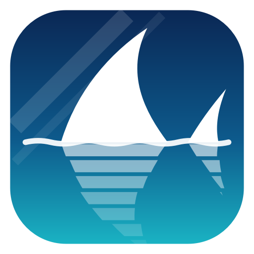
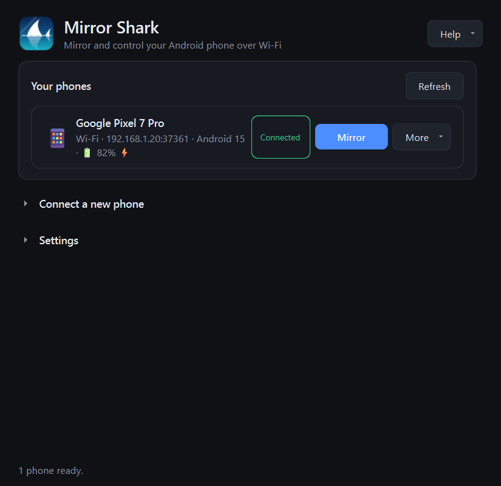
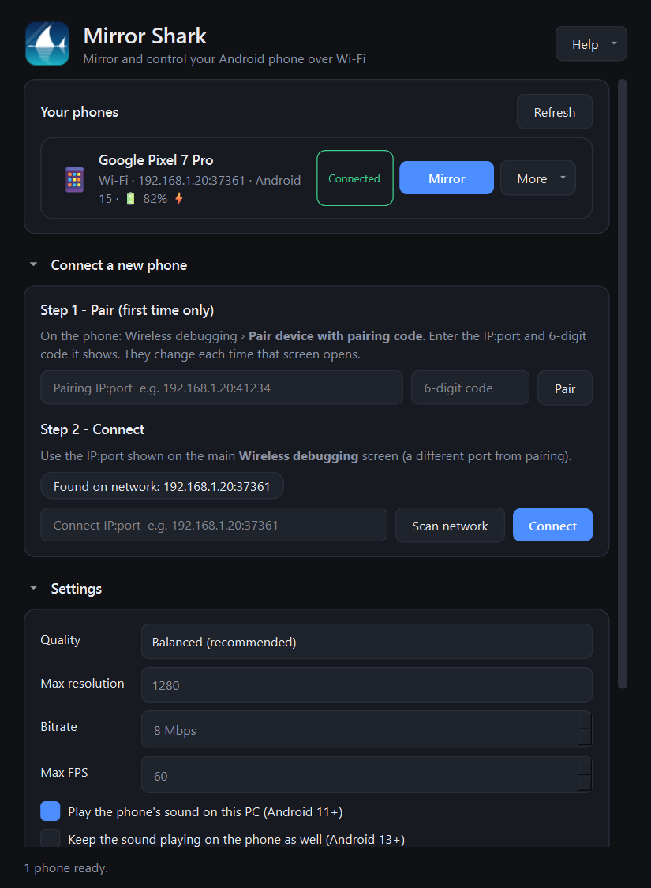
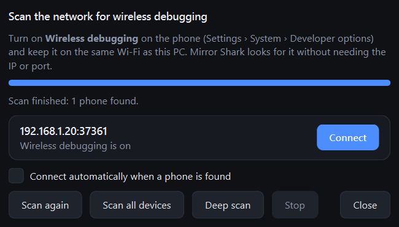

# Mirror Shark

[](https://github.com/CharmThiekshanaPerera/mirror-shark/actions/workflows/ci.yml)
[](https://github.com/CharmThiekshanaPerera/mirror-shark/releases/latest)
[](LICENSE)


**Mirror and control your Android phone from your Windows PC over Wi-Fi.** No cable, no root, no extra tools to install: Mirror Shark is a single `.exe`.

<p align="center">
  
</p>

<p align="center">
  
</p>

## Features

- **Wireless screen mirroring** at up to 60 fps with low latency (H.264 hardware-encoded on the phone).
- **Full control** with mouse and keyboard: tap, swipe, scroll, type, back/home/recents, rotate, notifications, power.
- **Phone sound on your PC** (Android 11+), with a mute button.
- **MP4 screen recording** without re-encoding, so it costs almost no CPU.
- **Clipboard sync** both ways, plus screenshots and full-screen mode.
- **Drag and drop**: drop an `.apk` to install it, or any file to send it to the phone's Download folder.
- **Guided setup**: finds the phone on your network automatically (mDNS, plus a **network scanner** for when discovery is blocked), one-click connect, plain-language error messages, automatic reconnect.
- **Quality presets** (Balanced, Sharp, Smooth, Data saver, Custom) and an optional **desktop mode** with its own virtual display.
- **Phone details** at a glance: model, Android version, battery.

| Connect and settings | Network scanner |
|---|---|
|  |  |

## Quick start

1. Download `MirrorShark-<version>-win64.zip` from the [latest release](https://github.com/CharmThiekshanaPerera/mirror-shark/releases/latest), unzip it and run `MirrorShark.exe`.
2. On the phone: **Settings > System > Developer options > Wireless debugging** and turn it on. (Enable Developer options first by tapping **Build number** seven times in *About phone*.)
3. Phone and PC on the same Wi-Fi (or the PC on the phone's hotspot). First time only: pair with the code shown under *Pair device with pairing code* using **Connect a new phone** in Mirror Shark.
4. Your phone shows up under **Your phones**. Click **Mirror**.

The full walkthrough, controls, settings and troubleshooting are in the **[User Guide](docs/USER_GUIDE.md)** (also available in the app under *Help*).

> The exe is not code-signed, so Windows SmartScreen may warn the first time. Choose *More info > Run anyway*.

## Requirements

- Windows 10 or 11 (64-bit)
- Android 11 or newer (Wireless debugging). Phone sound needs Android 11+, keeping sound on the phone as well needs 13+.

## How it works

Mirror Shark is a client for the open-source [scrcpy](https://github.com/Genymobile/scrcpy) server. It pushes the server to the phone over ADB, opens a tunnel and then does everything on the PC side itself:

```
phone (scrcpy server) --H.264 video--> video.py (PyAV decode) --> Qt window
                      --raw PCM audio-> audio.py (QAudioSink)
PC input events ---> control.py --touch/keys/clipboard--> phone
adb.py: pairing, connect, mDNS discovery, file/APK transfer
```

| Path | Purpose |
|---|---|
| `mirrorshark/adb.py` | adb wrapper, bundled-tool installer, mDNS discovery |
| `mirrorshark/scanner.py` | network scanner: finds phones with wireless debugging without mDNS |
| `mirrorshark/server.py` | pushes/starts the scrcpy server, opens video, audio and control sockets |
| `mirrorshark/protocol.py` | wire format encode/decode (unit tested) |
| `mirrorshark/video.py`, `audio.py`, `recorder.py` | decoding, playback, MP4 recording |
| `mirrorshark/control.py` | touch, key, clipboard messages |
| `mirrorshark/ui/` | main window, mirror window, help dialog, widgets |
| `mirrorshark/theme.py`, `errors.py`, `log.py` | styling and icon, friendly error text, logging |
| `docs/USER_GUIDE.md` | end-user guide |

## Build from source

Requires Python 3.12+ on Windows.

1. Put these files in the folder **above** this repository's folder (they are not stored here): `adb.exe`, `AdbWinApi.dll`, `AdbWinUsbApi.dll` from the Android [platform-tools](https://developer.android.com/tools/releases/platform-tools), and `scrcpy-server` from [scrcpy 4.1](https://github.com/Genymobile/scrcpy/releases/tag/v4.1). Optionally add `LICENSE.txt` and `NOTICE.txt` to be included in the release zip.
2. Run:

```powershell
.\build.bat        # runs tests, makes the icon, builds dist\MirrorShark.exe and release\MirrorShark-<version>-win64.zip
.\run.bat          # or run from source (creates .venv on first run)
```

Tests: `.venv\Scripts\python -m pytest`. Smoke test a build against a connected phone: `dist\MirrorShark.exe --selftest` (mirroring) or `--scantest` (network scanner; result in `%LOCALAPPDATA%\MirrorShark\scantest.txt`) (writes `%LOCALAPPDATA%\MirrorShark\selftest.txt`).

The scrcpy server version must match `SERVER_VERSION` in `mirrorshark/protocol.py` (currently 4.1).

## Contributing

Bug reports and pull requests are welcome. See [CONTRIBUTING.md](CONTRIBUTING.md). For security issues see [SECURITY.md](SECURITY.md). Changes are listed in the [changelog](CHANGELOG.md).

## License

Mirror Shark is released under the [MIT License](LICENSE). It includes and depends on third-party software under their own licenses, see [THIRD_PARTY_NOTICES.md](THIRD_PARTY_NOTICES.md).
